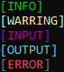
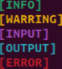
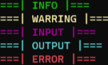
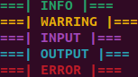
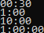
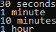

# PyEnhance

## Overview

Version: Beta 0.1.3.1

PyEnhance is a python library with essential tools for any python project.

The modules included in this library are the following:

* Stamps
* Banners
* Loading Indicators
* Timer
* WebTools
* TextSets
* Counter

<i>
     
</i>

## Installation

To install PyEnhance just run the following command in your terminal of choice.

    pip install PyEnhance

<i>
     
</i>

## Modules

The following section provides all the information needed for the use of the modules included in this library.

<i>
     
</i>

## Stamps

The Stamps module consist of pre-made status decorators meant for use in a CLI interface.

**Stamps Available:**

* Info
* Warring
* Input
* Output
* Error

### Usage

**Importing the Library**

    from PyEnhance import Stamps

<i>
     
</i>

**Using the stamps**

    Stamp = Stamps.Stamp # sets Stamp as an alias for Stamps.Stamp, enabling easier and more readable in the code.

    print(Stamp.<StampName>)

<i>
 
</i>

**Example**

    from PyEnhance import Stamps

    Stamp = Stamps.Stamp 

    print(Stamp.Info)
    print(Stamp.Warring)
    print(Stamp.Input)
    print(Stamp.Output)
    print(Stamp.Error)

<i>
     
</i>

**Visual Output**

| Operating System|Output on OS|
| Windows 10 | |
| Linux (Ubuntu) | |
|---------|---|

<i>
     
     
     
</i>

## Banners

**Banners Available:**

* Info
* Warring
* Input
* Output
* Error

### Usage

**Importing the Library**

    from PyEnhance import Banners

<i>
     
</i>

**Using the Banners**

    Banner = Banners.Banner # sets Banner as an alias for Banner.Banner, enabling easier and more readable in the code.

    print(Banner.<BannerName>)

<i>
     
</i>

**Example**

    from PyEnhance import Banners

    Banner = Banners.Banner

    print(Banner.Info)
    print(Banner.Warring)
    print(Banner.Input)
    print(Banner.Output)
    print(Banner.Error)

<i>
     
</i>

**Visual Output**

| Operating System | Output on OS                  |
|------------------|-------------------------------|
| Windows 10       |  |
| Linux (Ubuntu)   |      |

## Loading

The Loading module consist of different visual loading indicators.

**Types of Loading Indicators**

| Loading Indicator Type | Example (Windows CMD)                   |
|------------------------|-----------------------------------------|
| Spin                   |    |
| Bar                    |      |
| Stats                  |  |

<i>
 
</i>

### Usage

**Importing the Library**

    from PyEnhance import Loading

### Spin

**Parameters**

Text: The text that appears in front of the spinner

**Usage**

Set alies for easy usage and readability:
    
    Loading = Loading.Loading()

To start the loading animation:

    Loading.Spin(Text="Any String")

To stop the loading animation:
    
    Loading.Stop()

**Example**

    from PyEnhance import Loading

    Loading = Loading.Loading()

    Loading.Spin(Text="Loading")
    
    # Your code here

    Loading.Stop() 

<i>
     
     
</i>

### Bar

**Parameters**

PrintSpeed: The time in seconds in between new bar segments being printed.

**Usage**

Set alies for easy usage and readability:

    Loading = Loading.Loading()

To start the loading animation:

    Loading.Bar(PrintSpeed=0.3)

To stop the loading animation:

    Loading.Stop()

**Example**

    from PyEnhance import Loading

    Loading = Loading.Loading()

    Loading.Bar(PrintSpeed=0.3)
    
    # Your code here

    Loading.Stop()

<i>
     
     
</i>

### Stats

**Parameters**

Range: Specifies the total range or the maximum count of the progress bar.

**Usage**

Set alies for easy usage and readability:

    Loading = Loading.Loading()

To using the loading animation the function placed in a loop.

    for i in range(20):
    
        # Your Code Here

        Loading.Stats(Range=20)

**Example**

    from PyEnhance import Loading

    Loading = Loading.Loading()

    ExampleList = [1, 2, 3, 4, 5]
    
    for i in range(len(ExampleList)):
    
        time.sleep(0.5)
    
        Loading.Stats(Range=len(ExampleList))

<i>
 
</i>

## Timer

This module as the name indicates is a timer it outputs the elapsed time in one of two formats determined by the user.

**Types Of Output**

| Output Forms    | Example (Windows CMD)                            |
|-----------------|--------------------------------------------------|
| Short (default) |  |
| Long            |    |

<i>
 
</i>

### Usage

**Importing the Library**

    from PyEnhance import Timer

**Parameters**

Form: Sets the type of output received by user. If no user input is provided Short is used by default.

Set alies for easy usage and readability:

    Timer = Timer.Timer()

Short form output:
    
    Timer.Start()
    
    # Your Code Here
    
    Timer.Stop()
    
    
Long form output:
    
    Timer.Start(Form="Long")
    
    # Your Code Here
    
    Timer.Stop()

**Examples**

Short Form Output:

    import time
    from PyEnhance import Timer

    Timer = Timer.Timer()
    
    Timer.Start()
    
    time.sleep(10)
    
    Timer.Stop()

Long Form Output:

    import time
    from PyEnhance import Timer

    Timer = Timer.Timer()
    
    Timer.Start(From="Long")
    
    time.sleep(10)

    Timer.Stop()

## WebTools

This module consist of tools relating to web requests and validation of URLs

**Tools included in the module**

- ValidTLD (Checks if a URL has a valid TLD)
- RefactorHTTP (Makes a http version of a user inputted URL)
- RefactorHTTPS (Makes a https version of a user inputted URL)
- HTTPcheck (Refactors a given URL to a http version and checks if it's valid)
- HTTPScheck (Refactors a given URL to a https version and checks if it's valid)
- RequestHeaders (Basic headers for making web requests)
- StatusCode (http/https status codes sorted by category for handling web request responses)

<i>
 
 
</i>

### Usage

**Importing the library**

    from PyEnhance import WebTools

### ValidTLD

Checks if a URL has a valid TLD

**Parameters**

URL: Any URL

**Usage**

Set alies for easy usage and readability:

    WebTools = WebTools.WebTools()

Checking TLD:
    
    if WebTools.ValidTLD(URL='www.google.com') == True:

**Example**
    
    from PyEnhance import WebTools

    WebTools = WebTools.WebTools()

    if WebTools.ValidTLD(URL='www.google.com') == True:
        print('TLDS is valid')
    else:
        print('TLDS is invalid')

### RefactorHTTP

Makes a http version of a user inputted URL

**Parameters**

URL: Any URL

**Usage**

Set alies for easy usage and readability:

    WebTools = WebTools.WebTools()

Refactor URL:

    URLHTTP = WebTools.RefactorHTTP(URL='www.google.com')

**Example**

    from PyEnhance import WebTools

    WebTools = WebTools.WebTools()

    URLHTTP = WebTools.RefactorHTTP(URL='www.google.com')

    print(f"URL Refactored to HTTP: {URLHTTP}")

### RefactorHTTPS

Makes a https version of a user inputted URL

**Parameters**

URL: Any URL

**Usage**

Set alies for easy usage and readability:

    WebTools = WebTools.WebTools()

Refactor URL:

    URLHTTPS = WebTools.RefactorHTTPS(URL='www.google.com')

**Example**

    from PyEnhance import WebTools

    WebTools = WebTools.WebTools()

    URLHTTPS = WebTools.RefactorHTTPS(URL='www.google.com')

    print(f"URL Refactored to HTTPS: {URLHTTPS}")

## HTTPcheck

Refactors a given URL to a http version and checks if it's valid

**Parameters**

URL: Any URL

**Usage**

Set alies for easy usage and readability:

    WebTools = WebTools.WebTools()

Check if http is valid:

    if WebTools.HTTPcheck(URL='www.google.com') == True:

**Example**

    from PyEnhance import WebTools

    WebTools = WebTools.WebTools()

    if WebTools.HTTPcheck(URL='www.google.com') == True:
        print('HTTP is Valid')

## HTTPScheck

Refactors a given URL to a https version and checks if it's valid

**Parameters**

URL: Any URL

**Usage**

Set alies for easy usage and readability:

    WebTools = WebTools.WebTools()

Check if http is valid:

    if WebTools.HTTPScheck(URL='www.google.com') == True:

**Example**

    from PyEnhance import WebTools

    WebTools = WebTools.WebTools()

    if WebTools.HTTPScheck(URL='www.google.com') == True:
        print('HTTP is Valid')

## RequestHeaders

Basic headers for making web requests

**Usage**

Set alies for easy usage and readability:

    WebTools = WebTools.WebTools()

Make web request:

    import requests # Any web request lib will work aslong as it supports headers
 
    r = requests.get("www.google.com", headers=WebTools.RequestHeaders)

**Example**

    from PyEnhance import WebTools

    import requests
    
    WebTools = WebTools.WebTools()
    
    r = requests.get("https://www.google.com", headers=WebTools.RequestHeaders)
    
    print(r)

<i>
     
     
     
</i>

## StatusCodes

This module consist of http/https status codes sorted by category for handling web request responses

**Status code category's included in the module**

- 1xx (Informational)
- 2xx (Successful)
- 3xx (Redirection)
- 4xx (Client Error)
- 5xx (Server Error)

**Usage**

Set alies for easy usage and readability:

    WebTools = WebTools.WebTools()

Calling Category's

    WebTools.StatusCodes.Informational
    WebTools.StatusCodes.Success
    WebTools.StatusCodes.Redirection
    WebTools.StatusCodes.ClientError
    WebTools.StatusCodes.ServerError
    

**Example**

    from PyEnhance import WebTools

    import requests

    WebTools = WebTools.WebTools()

    r = requests.get(URLHTTPS, headers=WebTools.RequestHeaders)

    if r.status_code in WebTools.PositiveStatusCodes:
        print(f"{r.status_code} is in PositiveStatusCodes list")
    

<i>
 
 
</i>

## TextSets

This module contains list of words/charters that can be used for filtering.

The text sets currently included are:

- Special Characters 
- Cuss Words

I plan on adding many more in the future.

**Usage**

**Importing the library**

    from PyEnhance import TextSets

Set alies for easy usage and readability:

    TextSet = TextSets.TextSet

Calling text sets

    TextSet.SpecialCharacters
    TextSet.CussWords

**Examples**

    from PyPiFiles import TextSets

    TextSet = TextSets.TextSet
    

    TestList = [0,1,2,'!']
    
    for i in (TextSet.SpecialCharacters):
        if i in TestList:
            print(f'Special Character Found: {i} at index {TestList.index(i)}')
    

    TestList2 = ['John', "Bob", "ass", "Chris", "BigAss"]
    
    for badword in (TextSet.CussWords):
        for word in TestList2:

            if badword in word.lower():
                print(f"Word Found: {badword} In {word}")

<i>
 
 
</i>

## Counter

This module like the name implies is a counter.

**Usage**

**Importing the library**

    from PyPiFiles import Counter

Set alies for easy usage and readability:

    Counter1 = Counter.Counter()  # Alies name can not be Counter

To add to the counter do 
    
    Counter1.Add()

To get the current total do

    Total = Counter1.Total

or

    print(Counter1.Total

**Example**

    from PyPiFiles import Counter
    
    Counter1 = Counter.Counter()
    Counter2 = Counter.Counter()
    
    for i in range(10):
        Counter1.Add()

    print(Counter1.Total)
    
    for i in range(10):
        Counter2.Add()

    print(Counter2.Total)
    
